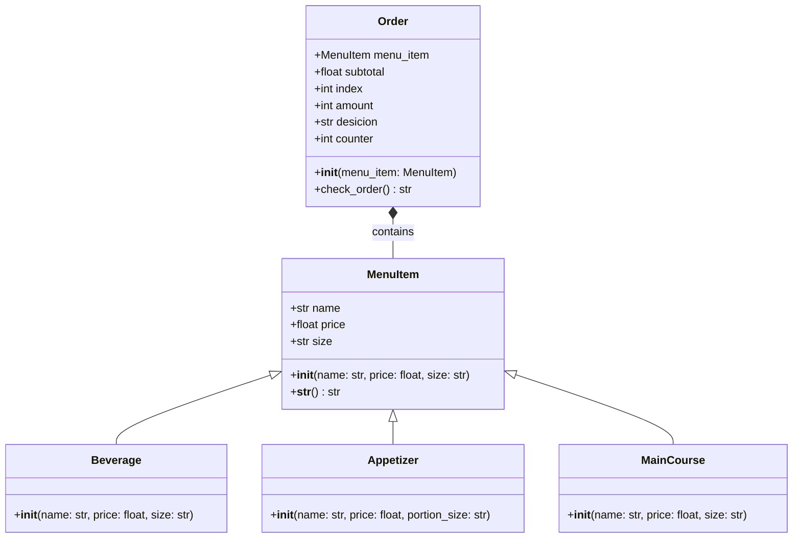

# Ejercicio (1): Clases Geométricas

Se creo un sistema que modela elementos geométricos básicos, como puntos, líneas y rectángulos. Permitiendo generar líneas entre puntos, calcular la longitud de las líneas, la pendiente, y los cruces con los ejes horizontal y vertical. También permite crear un rectángulo utilizando dos líneas y visualizar sus coordenadas.

## Desarrollo

1. **Clase `Point`**: Representa un punto en el plano cartesiano con dos coordenadas `x` y `y`.
   - Atributos:
     - `x`: Coordenada horizontal (int).
     - `y`: Coordenada vertical (int).
   - Métodos:
     - `__str__(self)`: Retorna una representación en cadena del punto.

2. **Clase `Line`**: Representa una línea recta definida por dos puntos `start` y `end`.
   - Atributos:
     - `start`: Un objeto de tipo `Point` que representa el inicio de la línea.
     - `end`: Un objeto de tipo `Point` que representa el final de la línea.
   - Métodos:
     - `compute_length()`: Calcula y retorna la longitud de la línea utilizando la fórmula de distancia euclidiana.
     - `compute_slope()`: Calcula y retorna la pendiente de la línea.
     - `compute_vertical_cross()`: Calcula el cruce con el eje vertical (intersección con el eje `y`).
     - `compute_horizontal_cross()`: Calcula el cruce con el eje horizontal (intersección con el eje `x`).

3. **Clase `Rectangle`**: Representa un rectángulo formado por dos líneas perpendiculares.
   - Atributos:
     - `line_1`: Una línea de tipo `Line`.
     - `line_2`: Otra línea de tipo `Line`.
     - `line_3` y `line_4`: Líneas adicionales que forman el rectángulo utilizando los puntos de `line_1` y `line_2`.
   - Métodos:
     - `__str__(self)`: Retorna una representación en cadena de los puntos que forman el rectángulo.

# Ejercicio (2): Sistema de un restaurante

Se creo un sistema simple para la toma de pedidos en un restaurante. Este sistema permite crear un menú con bebidas, aperitivos y platos principales, tambíen permite calcular el total de un pedido y si en el pedido hay más de tres artículos se le aplica un descuento del 10% al monto total del pedido.

## Desarrollo

1. **Clase `MenuItem`**: Representa un ítem del menú en el restaurante.
   - Atributos:
     - `name`: Nombre del ítem (str).
     - `price`: Precio del ítem (float).
     - `size`: Tamaño del ítem (str).
   - Métodos:
     - `__init__(name: str, price: float, size: str)`: Constructor de la clase.
     - `__str__()`: Método para representar el ítem como una cadena de texto.

2. **Clase `Beverage`**: Representa una bebida, que es un subtipo de `MenuItem`.
   - Atributos:
     - `size`: Tamaño de la bebida (str) (e.g., Small, Medium, Large).
   - Métodos:
     - `__init__(name: str, price: float, size: str)`: Constructor de la clase.

3. **Clase `Appetizer`**: Representa un aperitivo, que es un subtipo de `MenuItem`.
   - Atributos:
     - `portion_size`: Tamaño de la porción (str) (e.g., 6 pieces, 1 plate).
   - Métodos:
     - `__init__(name: str, price: float, portion_size: str)`: Constructor de la clase.

4. **Clase `MainCourse`**: Representa un plato principal, que es un subtipo de `MenuItem`.
   - Atributos:
     - `size`: Descripción del plato (str).
   - Métodos:
     - `__init__(name: str, price: float, size: str)`: Constructor de la clase.

5. **Clase `Order`**: Representa un pedido de un cliente.
   - Atributos:
     - `menu_item`: Lista de ítems del menú (`MenuItem`).
     - `subtotal`: Total del pedido (float).
     - `index`: Índice de un ítem en el menú (int).
     - `amount`: Cantidad de un ítem pedido (int).
     - `desicion`: Respuesta para continuar agregando ítems al pedido (str).
     - `counter`: Contador de la cantidad de ítems seleccionados (int).
   - Métodos:
     - `__init__(menu_item: MenuItem)`: Constructor de la clase.
     - `check_order()`: Calcula el total del pedido, con un posible descuento si el pedido tiene más de 3 ítems.

## UML

